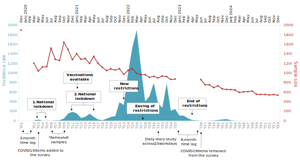

This demonstration showcases the planned documentation app for the Leipzig Momentum Panel on Worker Characteristics, Experiences, and Behavior. It illustrates the intended structure and functionality of the final tool.

## About the Data 

Data come from a large-scale longitudinal online survey study among employees in Germany. Data collection was funded by the Momentum program and, for some time, also by a module added to this program as part of the Volkswagen Foundation’s “Corona Crisis and Beyond” initiative. At the end of the study, we will have collected data at 54 measurements waves across 5 years (December 2019 to December 2024). 

This dataset is highly valuable and unique in psychological research due to the extensive number of monthly assessments across a relatively long time span and the large sample of employees (N = 1,897 at Time [T] 1 and n = 534 at T54) from all 16 German states and from heterogeneous occupations. Moreover, the dataset is of great historical value because it includes data on work characteristics as well as employee characteristics, experiences, and behavior collected before (i.e., early December 2019 and early March 2020), during, and after the COVID-19 pandemic. 

The study was originally (in 2019) designed to focus on employees’ health, aging, and work-related experiences and it was initially planned to include only 4 measurement waves separated by 3-month time lags (i.e., December 2019; March, June, September 2020). However, supported by funding from the Volkswagen Foundation, we adapted the study to monthly measurement waves starting in April 2020 to better understand the role of the COVID-19 pandemic in changes in work characteristics and employee experiences, health, and behavior. After the COVID-19 pandemic, we continued data collection to follow participating employees who provided monthly data on their work characteristics, experiences, health, and behavior. 

The sample comprises employees from all German states and a broad range of different occupations. To ensure data quality, an ISO 26362 certified professional panel company (Respondi/Bilendi) was commissioned to recruit participants from a nationally representative online panel in Germany. Participants had to be at least 18 years old and be working full-time. 

At T1, a total of 4,839 people in the panel company’s database were contacted, resulting in a starting sample of 1,897 employees in December 2019. Due to attrition of the initial sample, additional “refresher samples” of n = 500 participants were recruited by the panel company in July and October 2020 (T6 and T9) and these participants were also recontacted at subsequent measurement points. Overall, sample attrition has been relatively low across time, with the sample at T54 still comprising 534 employees. 

The dataset comprises various psychological constructs and measures, including demographic and employment characteristics, personality characteristics, health and well-being, employee attitudes and behaviors, and work characteristics. To measure these constructs, a range of established, reliable, and validated scales and items were employed, offering comprehensive insights into employee characteristics, experiences, and behaviors over time. Throughout the study, we assessed several constructs at each measurement wave from the same participants (e.g., physical and mental health, work characteristics such as workload and coworker support as well as job attitudes such as job satisfaction). Additionally, we iteratively added constructs to address evolving research questions (e.g., related to the pandemic situation) and capture contemporary issues (e.g., working from home) and, at later waves, we removed other constructs to free up space in the survey (e.g., COVID-19-related stressors). 

<table style="width:100%; border-collapse: collapse; margin-top: 1em;">
  <thead>
    <tr>
      <th style="border: 1px solid #ccc; padding: 8px;">Topics</th>
      <th style="border: 1px solid #ccc; padding: 8px;">Constructs</th>
    </tr>
  </thead>
  <tbody>
    <tr>
      <td style="border: 1px solid #ccc; padding: 8px;">Demographic and employment characteristics</td>
      <td style="border: 1px solid #ccc; padding: 8px;">Age, gender, education; job and industry description; “system-relevant occupation”; job status and level; job, organizational, occupational tenure.</td>
    </tr>
    <tr>
      <td style="border: 1px solid #ccc; padding: 8px;">Personality</td>
      <td style="border: 1px solid #ccc; padding: 8px;">Self-efficacy and self-esteem; extraversion, conscientiousness, agreeableness, emotional stability, openness to experience; proactive personality and trait mindfulness.</td>
    </tr>
    <tr>
   <td style="border: 1px solid #ccc; padding: 8px;">(Work) behavior</td>
      <td style="border: 1px solid #ccc; padding: 8px;">Task, adaptive, proactive behavior; job engagement; coping behavior; life management strategies (emotional regulation; selection, optimization, and compensation in goal pursuit); job crafting strategies.</td>
      </tr>
      <tr>
   <td style="border: 1px solid #ccc; padding: 8px;">(Occupational) health and well-being</td>
      <td style="border: 1px solid #ccc; padding: 8px;">Physical and mental health; work engagement and work fatigue; family and life satisfaction; positive and negative emotions; need satisfaction; sickness-related absenteeism and presenteeism.</td>
      </tr>
      <tr>
   <td style="border: 1px solid #ccc; padding: 8px;">Work attitudes</td>
      <td style="border: 1px solid #ccc; padding: 8px;">Job satisfaction; job boredom; turnover and retirement intentions; job insecurity (including job insecurity specifically due to the crisis).</td>
      </tr>
      <tr>
   <td style="border: 1px solid #ccc; padding: 8px;">Work characteristics</td>
      <td style="border: 1px solid #ccc; padding: 8px;">Job demands and autonomy; work constraints; idle time; coworker support and undermining; supervisor support and undermining; directive and empowering leadership; perceived organizational support; digitalization of work and flexible work.</td>
      </tr>
      <tr>
   <td style="border: 1px solid #ccc; padding: 8px;">Work-family</td>
      <td style="border: 1px solid #ccc; padding: 8px;">Work-family satisfaction and effectiveness; partner and family demands; partner and family support and undermining.</td>
      </tr>
      <tr>
   <td style="border: 1px solid #ccc; padding: 8px;">COVID-19</td>
      <td style="border: 1px solid #ccc; padding: 8px;">Personal infection, changes in hygiene behaviors, stress appraisals (e.g., threat, challenge, centrality, un/controllability of the changed personal situation due to the pandemic).</td>
      </tr>
      <tr>
   <td style="border: 1px solid #ccc; padding: 8px;">Changes in work arrangements</td>
      <td style="border: 1px solid #ccc; padding: 8px;">Changes in the nature of work and working times; percentage of working time spent with telework/in the home office; changes in childcare/ homeschooling arrangements.</td>
      </tr>
  </tbody>
</table>

In addition to the monthly assessments across 5 years, the dataset also includes data collected from the same employees in a quantitative “daily diary” study (i.e., experience sampling study) in August 2022. In this study, employees reported their work-related experiences, health, and behavior daily over the course of two consecutive work weeks. This daily diary data allows linking short-term fluctuations in experiences and behavior across days with longer-time developments in experiences and behavior across several years.

### Measurement Points

## How to use the App

The app will allow users to explore the dataset in two main ways:

**1. By Constructs**

A searchable, categorized list of constructs will be provided, organized by thematic domains.

**2. By Measurement Points**

Users can browse the dataset based on specific measurement time points. Selecting a measurement point will display all constructs surveyed at that time.  
Once one or more constructs are selected, the app will display detailed item-level information, including:

- Exact wording of survey questions
- Response options
- All measurement points where the item was included
- Corresponding sample sizes

In the final version, a structured database and interactive user interface will be developed to ensure seamless navigation, efficient data exploration, and quick access to rich metadata. The goal is to provide researchers and practitioners with clear, well-organized, and user-friendly documentation of the panel data.
